<p align="center">
  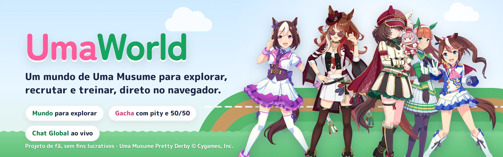
</p>

<p align="center">
  <b>Um mundo de Uma Musume para explorar, recrutar e treinar, direto no navegador.</b><br>
  Jogo web feito por fã, com mundo aberto, gacha, treino e um Chat Global em tempo real.
</p>

<p align="center">
  
  
  
  
  
  <br>
  
  
  
  
  <br>
  
  
  
  
  
  
</p>

> [!IMPORTANT]
> **Projeto de portfólio, sem fins lucrativos.** O UmaWorld é um projeto de fã, feito para estudo e para o meu portfólio. Não tem anúncios, compras nem qualquer tipo de monetização, e não é afiliado nem endossado pela Cygames. *Uma Musume Pretty Derby*, as personagens, os nomes e as artes oficiais pertencem à **Cygames, Inc.** Veja os [créditos](#créditos) no fim da página.

## Sobre o projeto

O UmaWorld é um jogo de coleção e treino inspirado em *Uma Musume Pretty Derby*. Em vez de menus, a tela principal é um **mapa da Academia Tracen** visto de cima. Você anda por ele com a sua própria corredora, uma das personagens que conseguiu no gacha, e entra nos prédios para recrutar, treinar, cuidar da fazenda e cumprir missões.

O jogo é single player, mas o servidor é um só. Os outros jogadores online passeiam pela Praça com as corredoras deles, e tudo o que acontece de importante aparece para todo mundo no **Chat Global**, ao vivo:

```
Luna conseguiu [5★ Satono Diamond] com 90 pity.
Akemi alcançou Rank Ouro.
O servidor chegou a 500 pulls!
```

Todo sorteio, custo e recompensa é calculado no servidor. Por isso nenhum "conseguiu 5★" do chat pode ser inventado pelo console do navegador.

<p align="center">
  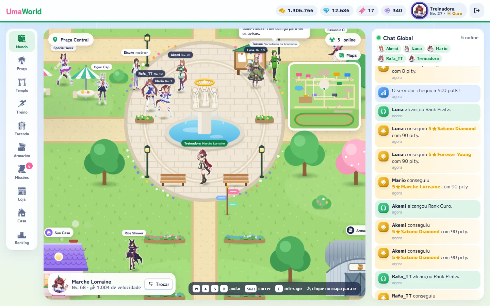
</p>

## O que tem no jogo

### Um mundo para explorar

- **Mapa grande:** são 3600 × 3360 px de academia, com prédios, lago, plantação, jardins e um minimapa clicável.
- **Controles:** a corredora anda com WASD ou pelas setas, corre com Shift e interage com E. Também dá para clicar em qualquer ponto do mapa: ela encontra o caminho sozinha, desviando dos obstáculos (A\*).
- **Uma Musumes pela Academia:** 15 personagens ficam espalhadas pelo mapa, cada uma no seu canto. Quando você chega perto, elas viram, dão um pulinho e puxam conversa. A Gold Ship pesca no lago, a Special Week e a Oguri Cap ficam no refeitório, e a Fukukitaru lê a sorte no Templo.
- **NPCs da Academia:** a Tazuna cuida do quadro de avisos, a repórter Etsuko anuncia as 5★ do servidor e a diretora Yayoi dá conselhos.

<table>
  <tr>
    <td width="50%">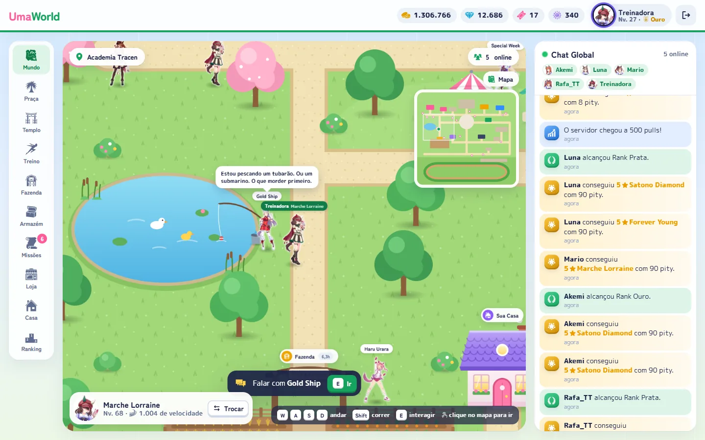</td>
    <td width="50%">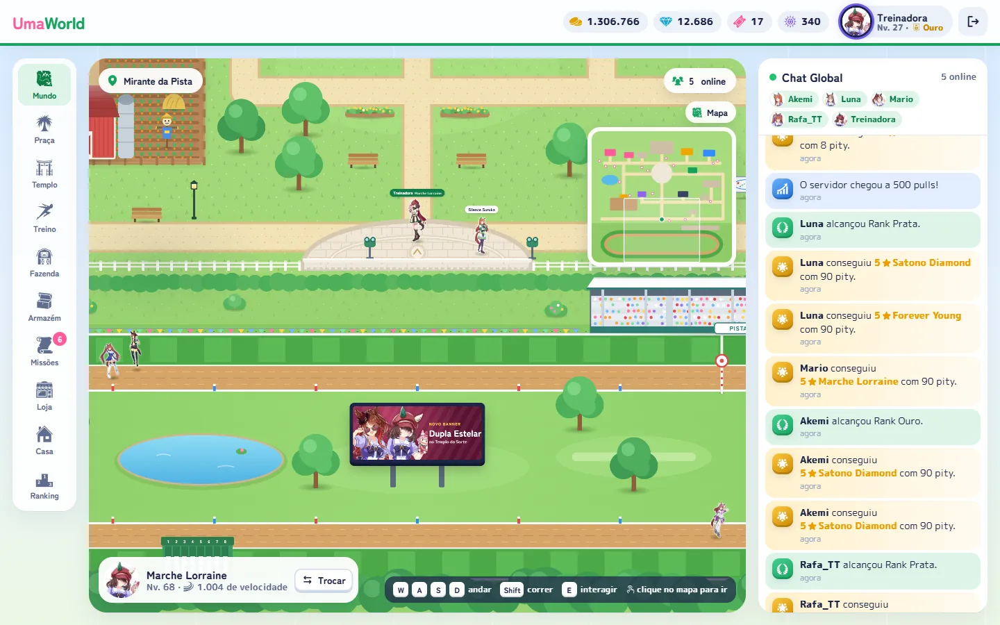</td>
  </tr>
  <tr>
    <td align="center">Chegue perto e aperte E: cada Uma tem as suas falas.</td>
    <td align="center">No Mirante, a câmera se afasta e mostra a Pista de Corrida.</td>
  </tr>
</table>

Fora da cerca fica a **Pista de Corrida**, com grama, areia, arquibancada, portão de largada e um telão. Seis Umas correm voltas e se ultrapassam o tempo todo.

### Templo da Sorte (gacha)

<p align="center">
  
</p>

- **Três banners:** o **Holofote** é limitado e troca toda semana. A **Dupla Estelar** é limitada e tem duas 5★ em destaque, a Forever Young e a Marche Lorraine. A **Corrida das Lendas** é o banner permanente.
- **Regras de gacha de verdade:**
  - pity de 90, com pity suave a partir do 74;
  - 4★ garantida a cada 10 pulls;
  - regra 50/50 com garantia, compartilhada entre os dois banners limitados.
- **De 1 a 10 pulls por vez:** os tickets são gastos primeiro, e o que faltar sai em carats.
- **A revelação:** você rasga um bilhete, e a luz do picote já mostra a maior raridade: azul, roxa ou cromado holográfico na 5★. Depois as cartas viram uma a uma, e a arte da 5★ sai da própria carta.

<table>
  <tr>
    <td width="50%">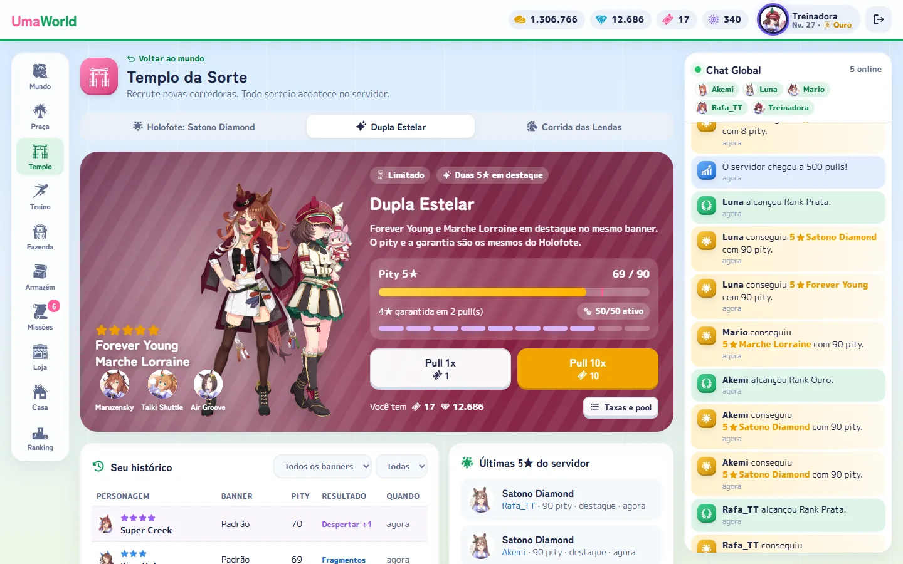</td>
    <td width="50%">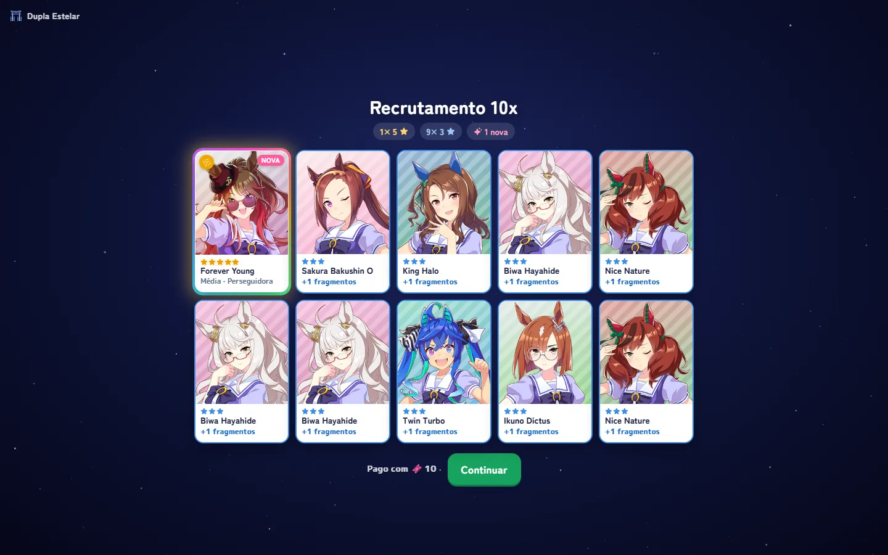</td>
  </tr>
  <tr>
    <td align="center">O banner Dupla Estelar, com o pity e a garantia.</td>
    <td align="center">O resultado de um 10x: cópias viram despertar e, depois, fragmentos.</td>
  </tr>
</table>

### Treino, coleção e progresso

<table>
  <tr>
    <td width="33%">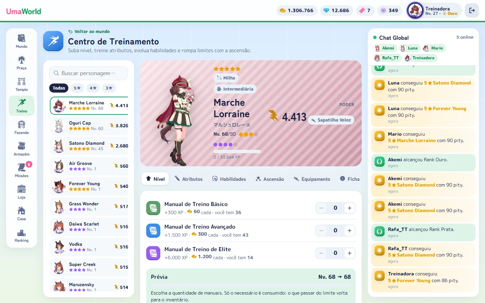</td>
    <td width="33%">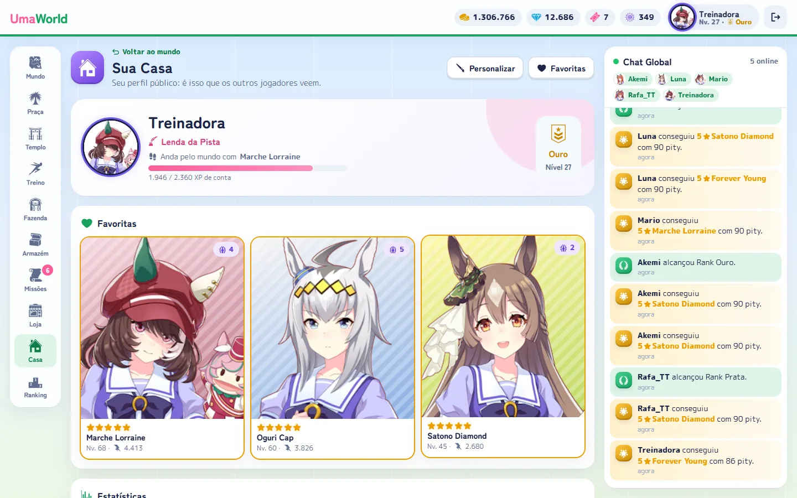</td>
    <td width="33%">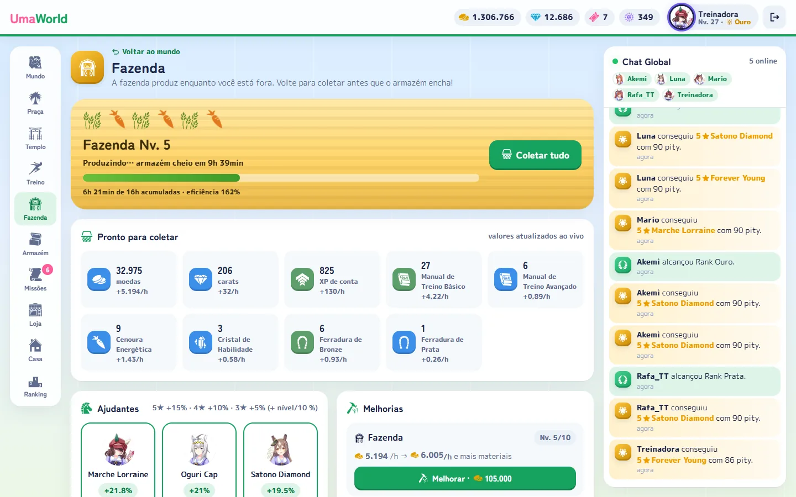</td>
  </tr>
  <tr>
    <td align="center"><b>Centro de Treinamento</b><br>Nível, atributos, habilidades, ascensão, equipamento e a ficha oficial de cada Uma.</td>
    <td align="center"><b>Sua Casa</b><br>Título, moldura, favoritas, estatísticas, conquistas e a coleção completa.</td>
    <td align="center"><b>Fazenda</b><br>Produz recursos enquanto você está fora. As ajudantes aumentam a produção.</td>
  </tr>
</table>

Também tem **Missões** diárias, semanais e conquistas, uma **Loja** com limites por período e cosméticos, o **Armazém** com tudo o que você tem e o **Hall da Fama**, com rankings por nível, poder, pulls, coleção e 5★. Ao todo são **36 Umas** para colecionar.

### Funciona no celular

<p align="center">
  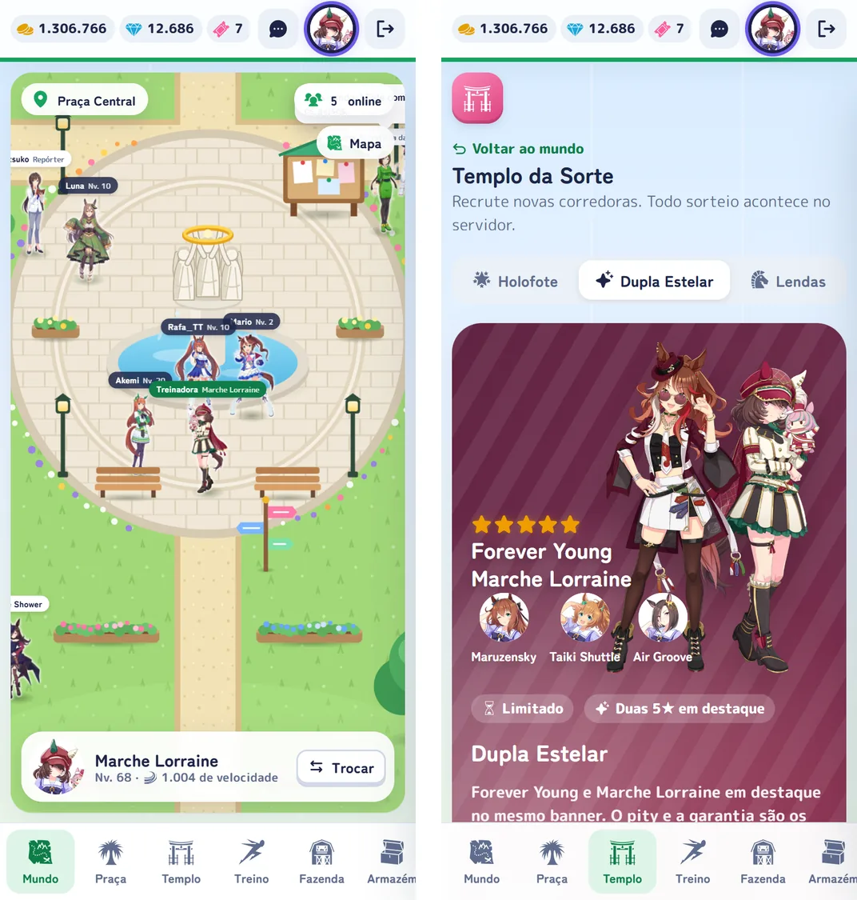
</p>

No celular, o menu vai para a parte de baixo da tela, o minimapa começa fechado e a corredora anda com um toque no mapa.

## Tecnologias

<p align="center">
  
</p>

| Parte | Tecnologia | Para quê |
|---|---|---|
| Servidor | **Python 3.13**, **FastAPI**, **Pydantic**, Uvicorn | API REST com todas as regras do jogo e validação dos dados |
| Tempo real | **WebSocket** (Starlette) | Chat Global e lista de quem está online |
| Banco de dados | **SQLAlchemy 2** com **PostgreSQL** no **Supabase** | Contas, coleção, pity, missões e histórico. Sem configuração, usa **SQLite** local |
| Login | **bcrypt** e **JWT** | Apelido e senha, sem e-mail |
| Frontend | **HTML**, **CSS** e **JavaScript** puro (ES modules) | Interface sem framework e sem etapa de build |
| Mundo | **SVG** desenhado em código e um motor próprio | Movimento, colisão, A\*, câmera com zoom e o andar das corredoras |
| Testes | **pytest** | 42 testes de gacha, economia, WebSocket, banco e desempenho |
| Hospedagem | **Render** (`render.yaml`) | Deploy pronto, com o banco no Supabase |

## Por baixo do capô

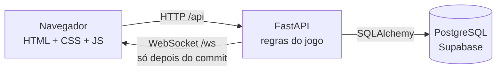

- **O servidor decide tudo:** sorteio, pity, custos e recompensas são calculados no backend, e o navegador só mostra o resultado.
- **O chat não mente:** cada anúncio é gravado na mesma transação da ação e só é enviado pelo WebSocket depois do commit. Se a ação falhar, ninguém vê um "conseguiu 5★" que não aconteceu.
- **Sem gasto duplo:** toda ação que gasta recursos começa travando a linha do jogador no banco. Dois cliques rápidos no 10x rodam um depois do outro, e o saldo nunca é gasto duas vezes.
- **Poucas idas ao banco:** em produção, o servidor (Render, na Virgínia) fica longe do banco (Supabase, em São Paulo), e cada consulta custa uns 120 ms. Por isso cada ação lê o que precisa de uma vez. Um 10x faz umas 17 consultas, e um teste falha se alguma tela voltar a fazer uma consulta por item.
- **O mundo roda no navegador:** os cenários são SVG gerados em código. As corredoras são imagens paradas, e o andar é procedural, com quique no ritmo da velocidade, inclinação e troca de peso entre os pés.
- **As artes ficam no projeto:** os dados oficiais e as imagens vêm da API do [umapyoi.net](https://umapyoi.net). Uma ferramenta baixa tudo uma única vez, já recortado e em WebP, e o jogo nunca chama a API enquanto roda.

## Como rodar localmente

Precisa de **Python 3.11 ou mais novo** (o projeto usa o 3.13).

```powershell
python -m venv .venv
.\.venv\Scripts\Activate.ps1        # no Linux/macOS: source .venv/bin/activate
pip install -r requirements-dev.txt
uvicorn app.main:app --reload
```

Abra **http://127.0.0.1:8000** e crie uma conta. Sem nenhuma configuração, o jogo usa um banco SQLite local, criado sozinho na primeira vez. Para usar PostgreSQL, copie o `.env.example` para `.env` e preencha o `DATABASE_URL`.

Para ver a Praça com outros jogadores e o Chat Global ao vivo, abra uma segunda janela anônima e entre com outra conta.

```powershell
pytest    # 42 testes; sempre usam um SQLite temporário
```

## Créditos

- ***Uma Musume Pretty Derby* © Cygames, Inc.** As personagens, os nomes e as artes oficiais pertencem à Cygames e aparecem aqui só em um projeto de fã, sem fins lucrativos. Se você representa a Cygames e quer que algo seja removido, abra uma issue.
- **Dados e artes:** obtidos pela API pública do [umapyoi.net](https://umapyoi.net), um projeto da comunidade.
- **Ícones do jogo:** [game-icons.net](https://game-icons.net) (Lorc, Delapouite e colaboradores, CC BY 3.0) e [Phosphor Icons](https://phosphoricons.com) (MIT).
- **Fontes:** [Zen Maru Gothic](https://fonts.google.com/specimen/Zen+Maru+Gothic) e [M PLUS Rounded 1c](https://fonts.google.com/specimen/M+PLUS+Rounded+1c) (Google Fonts, SIL Open Font License).
- **Selos e ícones deste README:** [shields.io](https://shields.io) e [skillicons.dev](https://skillicons.dev).
